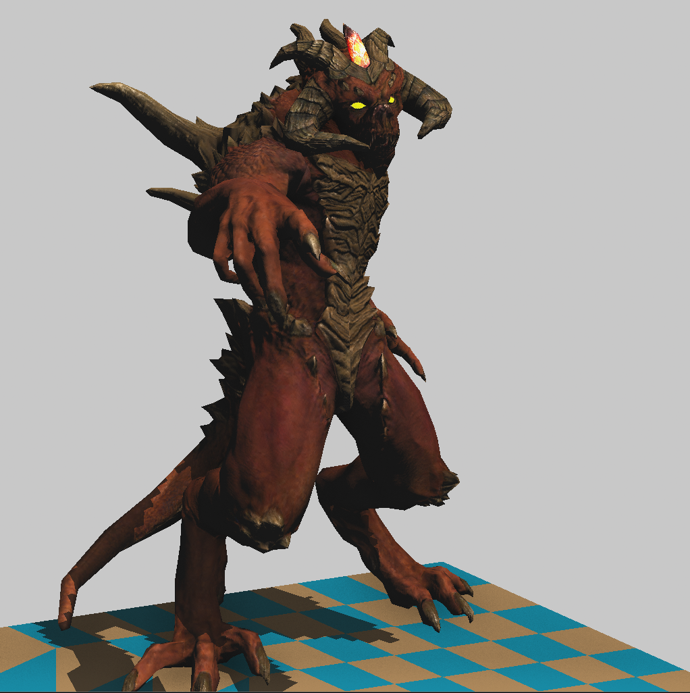

# Soft-Raster-Renderer

A CPU-based software rasterizer following the Tiny Renderer workflow, with a small but complete forward rendering pipeline. It loads OBJ models with multiple texture maps, renders into a TGA framebuffer, and applies simple shadow mapping plus screen-space ambient occlusion.

## Features

- OBJ model loading and batched triangle rendering
- TGA framebuffer output (`framebuffer.tga`)
- Z-buffered rasterization
- Diffuse + specular lighting
- Tangent-space normal mapping (TBN)
- Texture maps: diffuse, normal, specular, glow
- Shadow map pass in light space
- SSAO post-process sampling
- Simple camera and perspective setup

## Project Layout

- `Renderer.cpp`: main entry, render passes, SSAO, framebuffer output
- `Shaders.h`: shader implementations (depth, normal map, lighting, shadow)
- `RenderObjects.h`: model + material loader glue
- `ToolFunc.h/.cpp`: math, transforms, rasterization helpers
- `Models/`: example assets and textures

## How It Works (High Level)

1. Build light-space matrix and render a depth pass into the shadow buffer.
2. Render the scene with normal mapping and shadow lookup.
3. Run SSAO sampling on the final z-buffer and modulate the framebuffer.
4. Write the image to `framebuffer.tga`.

## Sample Output

Preview (PNG):

The original TGA output is also kept for reference:

- `framebuffer.tga`

## Build Notes

This is a Visual Studio C++ project. Open `Soft Raster Renderer.vcxproj` and build in VS (x64).
