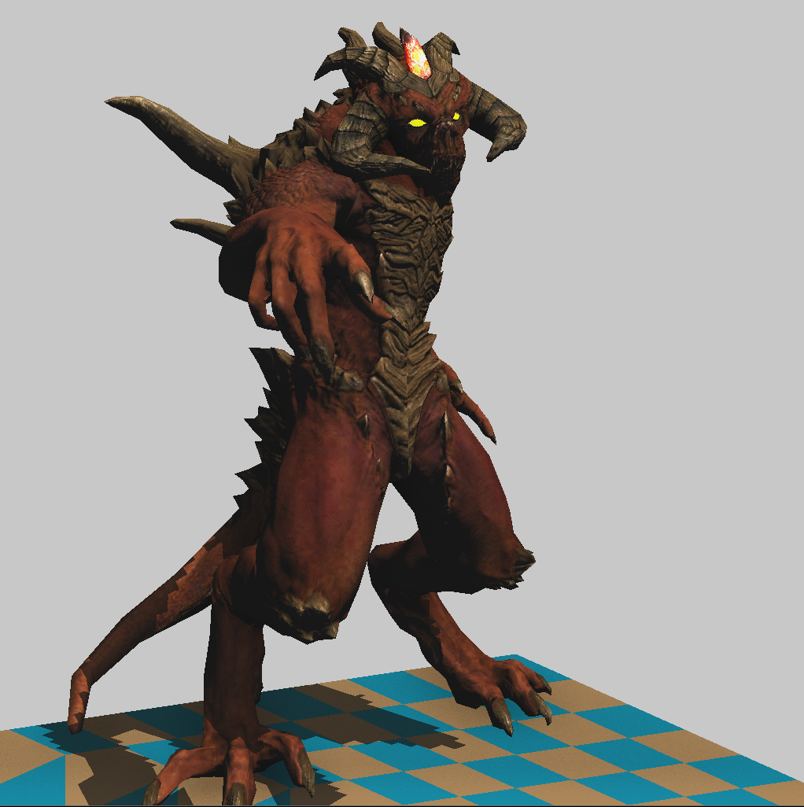

# Soft-Raster-Renderer

A compact C++ CPU rasterizer following the Tiny Renderer workflow. It renders OBJ triangles into a TGA image with a Z buffer, tangent-space normal mapping, a light-space shadow pass and screen-space ambient occlusion.

## Sample output



This is the existing project sample, not a new benchmark or a render produced by the cleanup. The original [framebuffer.tga](framebuffer.tga) and [AO.tga](AO.tga) are retained. **The scene geometry used for this preview is missing from the tracked repository**, so a fresh clone cannot recreate this image yet.

## Pipeline and code

1. `ObjLoader.h` reads positions, UVs and normals and fan-triangulates OBJ faces.
2. `Renderer.cpp` draws a light-space depth pass into the shadow buffer.
3. `Shaders.h` performs diffuse/specular lighting, TBN normal mapping and shadow lookup.
4. SSAO samples the camera depth buffer and modulates the framebuffer; OpenMP can parallelize this pass.
5. `tgaimage.h/.cpp` writes the final TGA.

`ToolFunc.h/.cpp` contains the small vector/matrix, camera and barycentric rasterization helpers. `RenderObjects.h` connects meshes to diffuse, normal, specular and optional glow maps. The code is deliberately kept in a handful of files for reading and experimentation.

## Build

No external C++ libraries are required. Use CMake 3.20 or newer and a C++20 compiler. OpenMP is optional and is enabled when available.

From the repository root on Windows with Visual Studio 2022 C++ tools:

```powershell
cmake -S . -B build -G "Visual Studio 17 2022" -A x64
cmake --build build --config Release
./build/Release/Soft-Raster-Renderer.exe ./build/framebuffer.tga
```

For GCC or Clang on another platform:

```sh
cmake -S . -B build -DCMAKE_BUILD_TYPE=Release
cmake --build build --parallel
./build/Soft-Raster-Renderer ./build/framebuffer.tga
```

Use `-DSOFT_RASTER_OPENMP=OFF` to build the serial SSAO path. The original Visual Studio project is preserved; it currently targets the `v145` toolset, so CMake is the simpler route for Visual Studio 2022. The first optional program argument selects the output TGA path. Running with the shown `build/framebuffer.tga` path preserves the tracked historical sample.

## Required scene files

Run from the repository root because asset paths are relative to the working directory. The current scene tries to load:

- `Models/diablo3_pose/diablo3_pose.obj`
- `Models/floor/floor.obj`

Neither OBJ file is tracked at present; the textures are present. Supply the original files only if you have permission to use them. A blanket `*.obj` ignore previously hid model assets; the ignore now allows models under `Models/`. Missing individual models are skipped, and a scene with no loaded models returns a failure instead of writing a blank successful render. Missing textures use the existing fallback maps.

## Validation and limits

The CMake path was configured and built on Windows with MSVC 19.38, x64 Release and OpenMP 2.0. A temporary, newly authored two-triangle scene exercised depth, shading, SSAO and TGA output; this does not reproduce the original preview. Serial, one-thread and four-thread outputs matched byte-for-byte. The fresh clone was also checked to fail clearly for missing geometry, and an unwritable output path returned a failure. Linux/macOS compilation has not been verified in this environment.

This is an educational renderer: interpolation is affine in screen-space barycentric coordinates; triangles with nonpositive clip-space `w` are rejected rather than fully clipped. The OBJ loader expects positive position indices, and the normal-mapping path needs nondegenerate UVs and appropriate vertex normals. The existing preview is not a performance measurement.

## References and asset rights

- [Tiny Renderer by Dmitry Sokolov](https://github.com/ssloy/tinyrenderer) is the tutorial reference for the rasterization workflow and TGA support; [Lesson 8](https://github.com/ssloy/tinyrenderer/wiki/Lesson-8%3A-Ambient-occlusion) covers ambient occlusion.
- [Models/diablo3_pose/readme.txt](Models/diablo3_pose/readme.txt) retains its original Samuel Sharit credit and informal permission correspondence.
- The existing [MIT LICENSE](LICENSE) is preserved. The credit correspondence alone does not establish the redistribution rights of all model/texture content. The floor texture source and exact third-party asset licenses still need confirmation. No new third-party model or texture is added by this cleanup.
